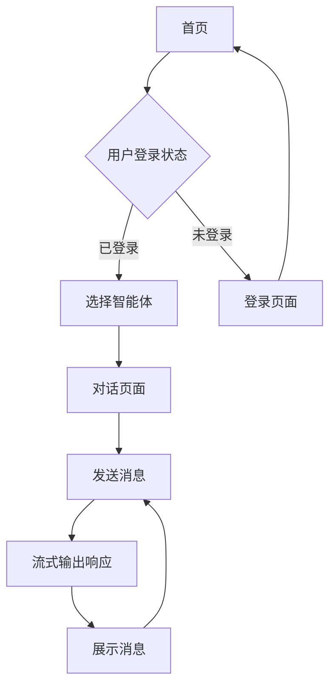

## 1. 产品概述
多智能体对话平台是一个基于AI的智能对话系统，用户可以与不同的AI智能体进行实时对话交流。平台采用流式输出技术，提供流畅的对话体验，帮助用户获得智能化的问答服务。

目标用户包括需要AI助手服务的个人用户和企业用户，通过简洁优雅的界面设计提供高质量的AI对话服务。

## 2. 核心功能

### 2.1 用户角色
| 角色 | 注册方式 | 核心权限 |
|------|----------|----------|
| 普通用户 | 邮箱注册 | 浏览智能体、进行对话、查看历史记录 |
| 管理员 | 后台创建 | 管理智能体、查看统计数据、用户管理 |

### 2.2 功能模块
平台包含以下主要页面：
1. **首页**：展示可用智能体卡片、导航栏、用户登录状态
2. **对话页面**：聊天界面、会话历史侧边栏、智能体信息展示
3. **登录页面**：用户登录、注册功能

### 2.3 页面详情
| 页面名称 | 模块名称 | 功能描述 |
|----------|----------|----------|
| 首页 | 导航栏 | 显示Logo、用户登录状态、语言切换 |
| 首页 | 智能体卡片展示区 | 展示所有可用智能体的卡片，包含头像、名称、简介、状态 |
| 首页 | 用户操作区 | 登录/注册按钮、个人中心入口 |
| 对话页面 | 会话历史侧边栏 | 显示与该智能体的历史会话列表，支持新建会话、删除会话 |
| 对话页面 | 聊天区域 | 消息展示、输入框、发送按钮、流式输出显示 |
| 对话页面 | 智能体信息栏 | 显示当前智能体名称、简介、状态信息 |
| 登录页面 | 登录表单 | 邮箱/密码输入、登录按钮、第三方登录选项 |
| 登录页面 | 注册表单 | 邮箱验证、密码设置、用户信息填写 |

## 3. 核心流程
用户操作流程：
1. 用户访问首页 → 浏览智能体卡片 → 选择智能体 → 进入对话页面
2. 用户登录 → 输入凭据 → 验证成功 → 返回首页或目标页面
3. 对话流程：输入消息 → 发送请求 → 接收流式响应 → 消息展示

## 4. 用户界面设计

### 4.1 设计风格
参考Stripe.com的设计理念：
- **主色调**：渐变蓝紫色系（#667eea → #764ba2）
- **辅助色**：浅灰色（#f6f9fc）、白色（#ffffff）
- **按钮风格**：圆角矩形，渐变背景，悬停效果
- **字体**：现代无衬线字体，主标题24-32px，正文14-16px
- **布局风格**：卡片式布局，大量留白，层次分明
- **图标风格**：线性图标，简洁现代

### 4.2 页面设计概述
| 页面名称 | 模块名称 | UI元素 |
|----------|----------|--------|
| 首页 | 导航栏 | 左侧Logo，右侧用户操作区，背景白色带阴影 |
| 首页 | 智能体卡片 | 圆角卡片设计，渐变边框，包含圆形头像、名称、简介 |
| 对话页面 | 侧边栏 | 左侧固定宽度，会话列表，新建会话按钮 |
| 对话页面 | 聊天区域 | 类似ChatGPT布局，消息气泡区分用户和AI |
| 对话页面 | 输入区域 | 底部固定，圆角输入框，发送按钮带渐变 |

### 4.3 响应式设计
采用桌面端优先的设计策略：
- 桌面端：完整功能展示，最佳体验
- 平板端：自适应布局，侧边栏可收起
- 移动端：单栏布局，底部导航，触摸优化