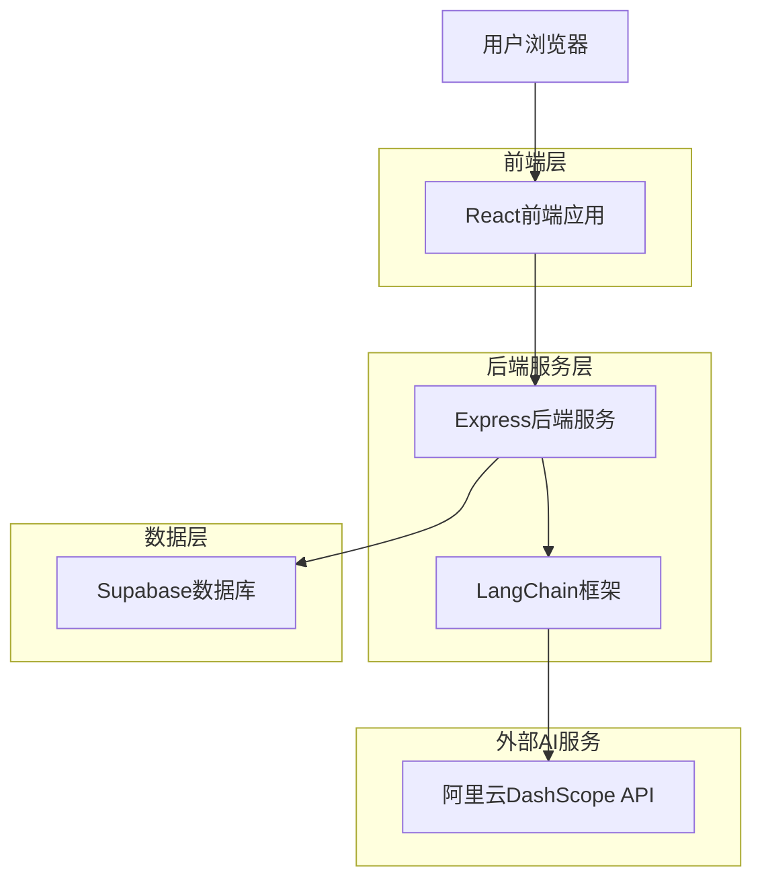
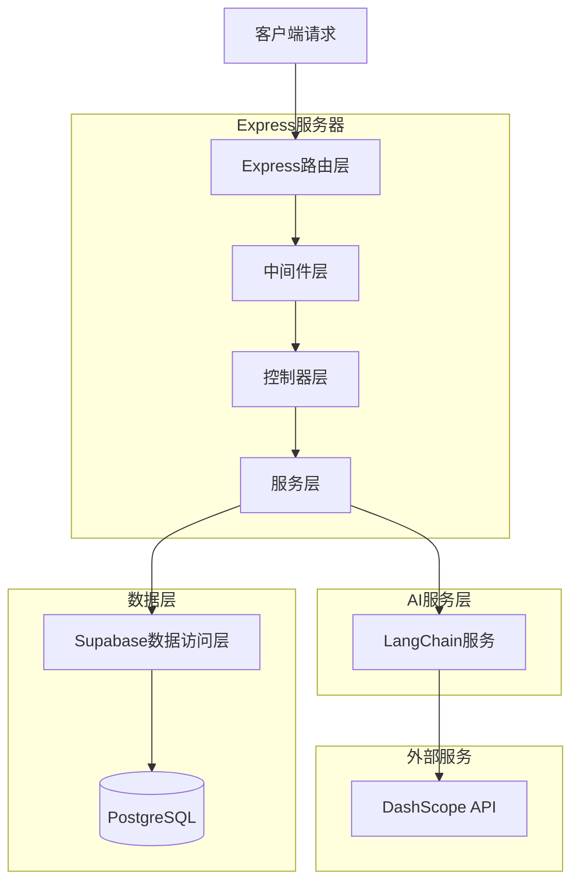
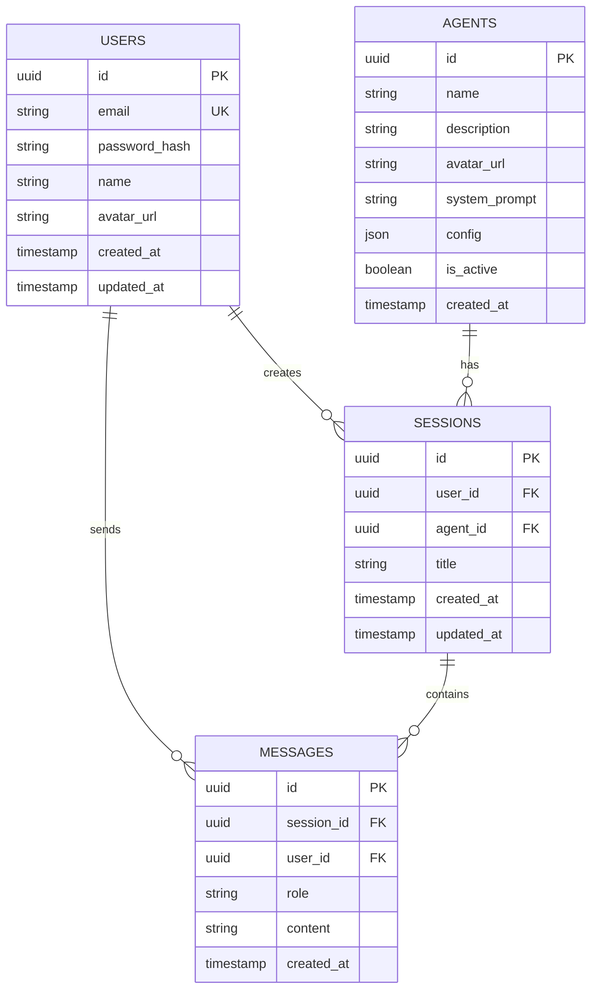

## 1. 架构设计



## 2. 技术描述

- **前端**: React@18 + TailwindCSS@3 + Vite
- **初始化工具**: vite-init
- **后端**: Express@4 + LangChain@0.1
- **数据库**: Supabase (PostgreSQL)
- **AI服务**: 阿里云DashScope API
- **状态管理**: React Context + useState
- **UI组件**: HeadlessUI + 自定义组件

## 3. 路由定义

| 路由 | 用途 |
|------|------|
| / | 首页，展示智能体卡片 |
| /login | 登录页面 |
| /register | 注册页面 |
| /chat/:agentId | 与指定智能体对话页面 |
| /profile | 用户个人中心 |

## 4. API定义

### 4.1 认证相关API

**用户注册**
```
POST /api/auth/register
```

请求参数：
| 参数名 | 参数类型 | 是否必需 | 描述 |
|--------|----------|----------|------|
| email | string | 是 | 用户邮箱 |
| password | string | 是 | 用户密码 |
| name | string | 是 | 用户昵称 |

响应参数：
| 参数名 | 参数类型 | 描述 |
|--------|----------|------|
| success | boolean | 注册状态 |
| token | string | JWT令牌 |
| user | object | 用户信息 |

**用户登录**
```
POST /api/auth/login
```

请求参数：
| 参数名 | 参数类型 | 是否必需 | 描述 |
|--------|----------|----------|------|
| email | string | 是 | 用户邮箱 |
| password | string | 是 | 用户密码 |

### 4.2 智能体相关API

**获取智能体列表**
```
GET /api/agents
```

响应参数：
| 参数名 | 参数类型 | 描述 |
|--------|----------|------|
| agents | array | 智能体列表 |
| agents.id | string | 智能体ID |
| agents.name | string | 智能体名称 |
| agents.description | string | 智能体描述 |
| agents.avatar | string | 智能体头像URL |

### 4.3 对话相关API

**创建会话**
```
POST /api/sessions
```

请求参数：
| 参数名 | 参数类型 | 是否必需 | 描述 |
|--------|----------|----------|------|
| agentId | string | 是 | 智能体ID |
| title | string | 否 | 会话标题 |

**获取会话历史**
```
GET /api/sessions/:agentId
```

**发送消息（流式）**
```
POST /api/chat/stream
```

请求参数：
| 参数名 | 参数类型 | 是否必需 | 描述 |
|--------|----------|----------|------|
| sessionId | string | 是 | 会话ID |
| message | string | 是 | 用户消息 |
| agentId | string | 是 | 智能体ID |

响应：Server-Sent Events (SSE) 流式响应

## 5. 服务器架构图



## 6. 数据模型

### 6.1 数据模型定义



### 6.2 数据定义语言

**用户表（users）**
```sql
-- 创建用户表
CREATE TABLE users (
  id UUID PRIMARY KEY DEFAULT gen_random_uuid(),
  email VARCHAR(255) UNIQUE NOT NULL,
  password_hash VARCHAR(255) NOT NULL,
  name VARCHAR(100) NOT NULL,
  avatar_url TEXT,
  created_at TIMESTAMP WITH TIME ZONE DEFAULT NOW(),
  updated_at TIMESTAMP WITH TIME ZONE DEFAULT NOW()
);

-- 创建索引
CREATE INDEX idx_users_email ON users(email);
CREATE INDEX idx_users_created_at ON users(created_at DESC);

-- 授权访问
GRANT SELECT ON users TO anon;
GRANT ALL PRIVILEGES ON users TO authenticated;
```

**智能体表（agents）**
```sql
-- 创建智能体表
CREATE TABLE agents (
  id UUID PRIMARY KEY DEFAULT gen_random_uuid(),
  name VARCHAR(100) NOT NULL,
  description TEXT,
  avatar_url TEXT,
  system_prompt TEXT,
  config JSONB DEFAULT '{}',
  is_active BOOLEAN DEFAULT true,
  created_at TIMESTAMP WITH TIME ZONE DEFAULT NOW()
);

-- 插入测试智能体
INSERT INTO agents (name, description, avatar_url, system_prompt) VALUES
('AI助手', '通用型AI助手，可以回答各种问题', '/assets/ai-assistant.png', '你是一个 helpful AI assistant'),
('代码专家', '专业的编程助手，擅长代码相关的问题', '/assets/code-expert.png', '你是一个专业的编程助手，擅长各种编程语言');

-- 授权访问
GRANT SELECT ON agents TO anon;
GRANT ALL PRIVILEGES ON agents TO authenticated;
```

**会话表（sessions）**
```sql
-- 创建会话表
CREATE TABLE sessions (
  id UUID PRIMARY KEY DEFAULT gen_random_uuid(),
  user_id UUID REFERENCES users(id) ON DELETE CASCADE,
  agent_id UUID REFERENCES agents(id) ON DELETE CASCADE,
  title VARCHAR(255),
  created_at TIMESTAMP WITH TIME ZONE DEFAULT NOW(),
  updated_at TIMESTAMP WITH TIME ZONE DEFAULT NOW()
);

-- 创建索引
CREATE INDEX idx_sessions_user_id ON sessions(user_id);
CREATE INDEX idx_sessions_agent_id ON sessions(agent_id);
CREATE INDEX idx_sessions_created_at ON sessions(created_at DESC);

-- 授权访问
GRANT SELECT ON sessions TO anon;
GRANT ALL PRIVILEGES ON sessions TO authenticated;
```

**消息表（messages）**
```sql
-- 创建消息表
CREATE TABLE messages (
  id UUID PRIMARY KEY DEFAULT gen_random_uuid(),
  session_id UUID REFERENCES sessions(id) ON DELETE CASCADE,
  user_id UUID REFERENCES users(id) ON DELETE CASCADE,
  role VARCHAR(20) NOT NULL CHECK (role IN ('user', 'assistant', 'system')),
  content TEXT NOT NULL,
  created_at TIMESTAMP WITH TIME ZONE DEFAULT NOW()
);

-- 创建索引
CREATE INDEX idx_messages_session_id ON messages(session_id);
CREATE INDEX idx_messages_user_id ON messages(user_id);
CREATE INDEX idx_messages_created_at ON messages(created_at ASC);

-- 授权访问
GRANT SELECT ON messages TO anon;
GRANT ALL PRIVILEGES ON messages TO authenticated;
```

## 7. LangChain集成配置

**环境变量配置**
```env
# DashScope API配置
DASHSCOPE_API_KEY=your_api_key_here
DASHSCOPE_MODEL=qwen-turbo

# Supabase配置  
SUPABASE_URL=your_supabase_url
SUPABASE_ANON_KEY=your_anon_key
SUPABASE_SERVICE_KEY=your_service_key

# 服务器配置
PORT=3001
NODE_ENV=development
```

**LangChain流式处理示例**
```javascript
import { ChatOpenAI } from "@langchain/openai";
import { CallbackHandler } from "langchain/callbacks";

// 创建流式回调处理器
const createStreamHandler = (res) => {
  return new CallbackHandler({
    handleLLMNewToken(token) {
      res.write(`data: ${JSON.stringify({ token })}\n\n`);
    },
    handleLLMEnd() {
      res.write('data: [DONE]\n\n');
      res.end();
    }
  });
};
```